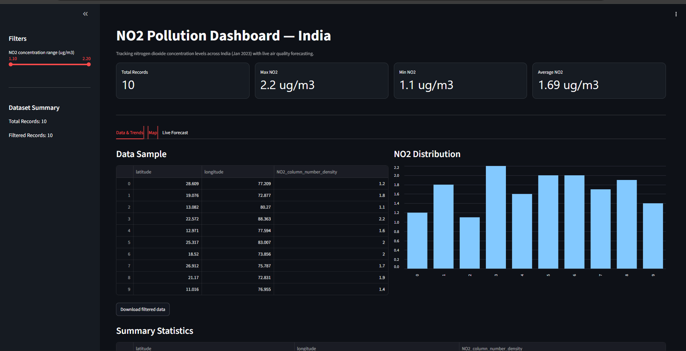
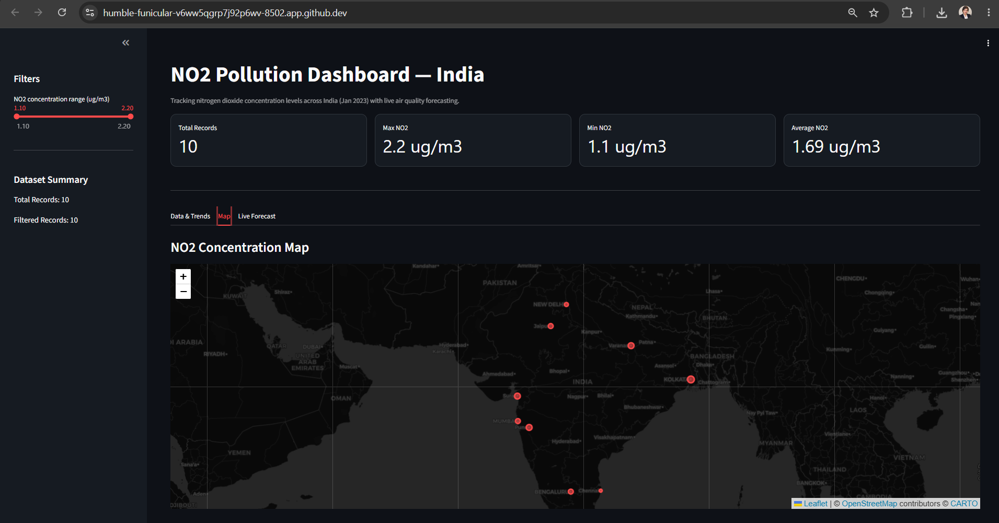
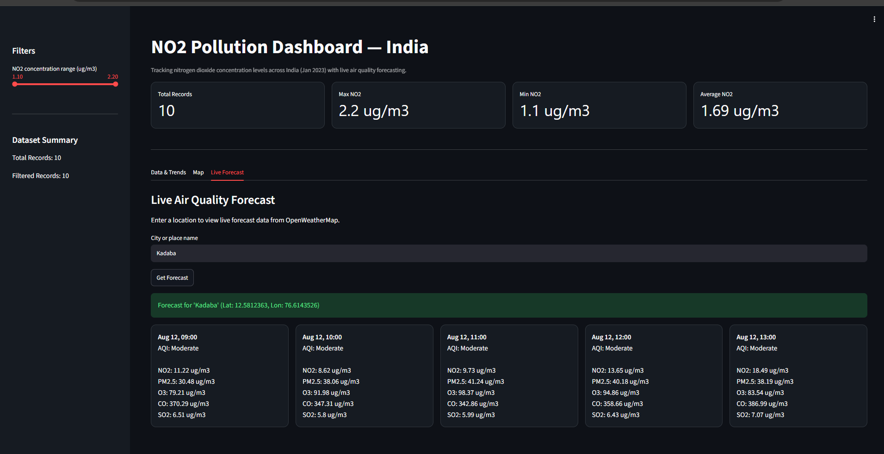

# NO₂ Pollution Dashboard

An interactive dashboard that visualizes nitrogen dioxide (NO₂) pollution levels across India using satellite data, with live air quality forecasting. Built with Python, Streamlit, and Folium.

## Overview

Air quality data is often locked away in technical satellite datasets that aren't easy for the public to explore. This dashboard processes NO₂ concentration data and presents it through an interactive, tab-based interface with maps, charts, and live forecasts — making pollution trends across India easy to understand.

## Features

- **KPI summary cards** — total records, max/min/average NO₂ concentration at a glance
- **Interactive filtering** — filter records by NO₂ concentration range via sidebar slider
- **Data & Trends tab** — sortable data table, distribution chart, downloadable CSV export
- **Map tab** — interactive dark-themed map (Folium) with concentration markers by location
- **Live Forecast tab** — real-time air quality forecast lookup by city, powered by the OpenWeatherMap API

## Tech Stack

**Language:** Python
**Web Framework:** Streamlit
**Mapping/Visualization:** Folium
**Data Processing:** pandas
**API:** OpenWeatherMap (Geocoding + Air Pollution Forecast)

## Screenshots





## Installation

```bash
git clone https://github.com/sneha70000/no2-pollution-dashboard.git
cd no2-pollution-dashboard
pip install -r requirements.txt
```

Create a `.env` file in the project root:
OPENWEATHER_API_KEY=
Then run:
```bash
streamlit run app1.py
```

## Live Demo

[View live dashboard](https://no2---dashboard-bnfswfqvfbyeyz8bw9c6yw.streamlit.app)

## Future Improvements

- Expand to real-time/live satellite data feed
- Add more pollutants (PM2.5, CO, SO₂) to the historical dataset view
- Historical trend charts and month-over-month comparison
